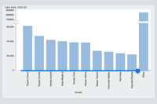

# Dynamic Top N and Binning Visualizations

[Ben Shneiderman](https://www.cs.umd.edu/users/ben/) taught us all to ["Overview first, zoom and filter, then details-on-demand"](https://www.perceptualedge.com/articles/b-eye/path_to_visual_discovery.pdf).

Does "zooming" include binning?  In graphs of aggregated data, zooming the scales may not help us explore.  Adjusting the bins and categories often can.

[This project demonstrates a user interface for interactive top N and binning visualizations.](https://hemanrobinson.github.io/top-n-binning/)

