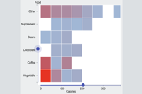

# Dynamic Binning

[This project demonstrates a user interface for interactive binning.](https://hemanrobinson.github.io/bin/)

[Ben Shneiderman](https://www.cs.umd.edu/users/ben/) taught us all to ["Overview first, zoom and filter, then details-on-demand"](https://www.perceptualedge.com/articles/b-eye/path_to_visual_discovery.pdf).

Does "zooming" include binning?  In graphs of aggregated data, zooming the scales may not help us explore.  Adjusting the bins often can.

This project uses [React](https://react.dev), [Material-UI](https://github.com/mui-org/material-ui), and [d3](https://github.com/d3/d3).
